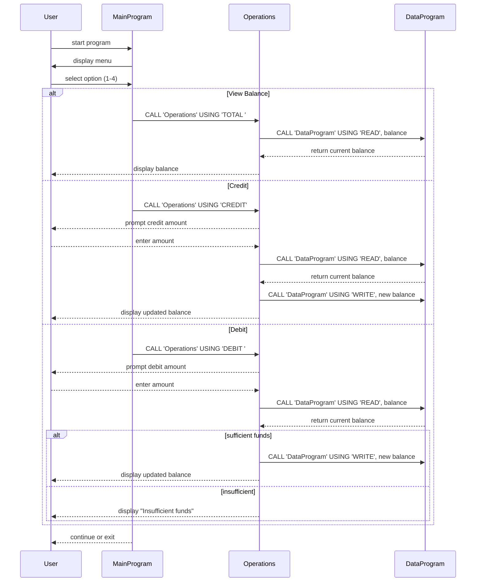

# COBOL Student Account Management System Documentation

This directory contains documentation for the legacy COBOL programs related to student account handling. The system consists of three main COBOL sources located in `src/cobol`:

- `main.cob`
- `operations.cob`
- `data.cob`

Each file serves a specific role in the application and implements basic business rules around account balances.

---

## File Purposes

### `main.cob`

- **Role:** Entry point and user interface logic.
- **Details:**
  - Presents a simple menu to the user for viewing balance, crediting, debiting, or exiting.
  - Reads the user’s choice and calls the `Operations` program with a corresponding operation type.
  - Maintains a loop (`CONTINUE-FLAG`) until the user chooses to exit.

### `operations.cob`

- **Role:** Core business logic for account operations.
- **Key Functions:**
  - **TOTAL:** Calls the `DataProgram` to read the current balance and displays it.
  - **CREDIT:** Prompts for an amount, reads the stored balance, adds the amount, writes the new balance, and displays confirmation.
  - **DEBIT:** Prompts for an amount, reads the stored balance, and if sufficient funds are available, subtracts the amount, updates storage, and displays confirmation. If funds are insufficient, the user is notified.
- **Interaction:** Receives operation types via the `LINKAGE SECTION` and uses the `PROCEDURE DIVISION` to branch accordingly.

### `data.cob`

- **Role:** Simulated persistent storage for the account balance.
- **Key Functions:**
  - **READ:** Copies a working-storage balance value to the caller-provided `BALANCE` parameter.
  - **WRITE:** Accepts a new balance value from the caller and stores it in `STORAGE-BALANCE`.
- **Behavior:** Uses a simple in-memory variable (`STORAGE-BALANCE`) to represent stored data. In a real system this might be file I/O or database interaction.

---

## Business Rules and Student Account Details

- **Initial Balance:** The system initializes new or existing student accounts with a default balance of `1000.00` units.
- **View Balance:** Always displays the currently stored balance without modifying it.
- **Credit Rules:** Users can increase their balance by inputting a credit amount. There's no upper limit enforced by the code.
- **Debit Rules:** Users can only debit an amount if the current balance is greater than or equal to the requested debit amount. Overdrafts are prevented; the system displays an "Insufficient funds" message otherwise.
- **Data Persistence:** The example uses in-memory storage for simplicity, meaning the balance resets when the program ends. A real-world modernization would replace `DataProgram` with persistent storage operations.

---

This README should serve as the starting point for anyone looking to understand or modernize the legacy COBOL system by outlining its components, workflows, and relevant business rules.

---

## Sequence Diagram

The following Mermaid sequence diagram illustrates the data flow and program interactions for a typical user session.

